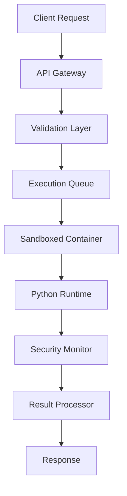

# @python-portal/executor

> **Secure Python code execution microservice with sandboxed environment and performance monitoring**

[](https://badge.fury.io/js/%40python-portal%2Fexecutor)
[](https://hub.docker.com/r/pythonportal/executor)
[](docs/SECURITY.md)
[](https://opensource.org/licenses/MIT)

## 🎯 Overview

The Python Portal Executor is a production-grade microservice designed to safely execute Python code in a sandboxed environment. Built with security, performance, and reliability as core principles, it provides isolated execution for educational Python exercises.

## 🔒 Security Features

### 🛡️ Sandboxing
- **Docker Containerization**: Isolated execution environment
- **Resource Limits**: CPU, memory, and execution time constraints
- **Network Isolation**: No external network access during execution
- **Filesystem Restrictions**: Read-only code execution with minimal write permissions

### 🚫 Security Restrictions
- **Import Filtering**: Whitelist of allowed Python modules
- **Dangerous Function Blocking**: Prevention of system calls, file operations
- **Code Injection Prevention**: AST parsing and validation
- **Output Sanitization**: Safe handling of execution results

### 📊 Resource Management
- **Execution Timeout**: Configurable time limits (default: 10 seconds)
- **Memory Limits**: Configurable RAM usage (default: 128MB)
- **CPU Throttling**: Prevent resource exhaustion
- **Concurrent Execution**: Queue-based execution with rate limiting

## 🏗️ Architecture



## 📦 Installation

### As NPM Package
```bash
npm install @python-portal/executor
# or
yarn add @python-portal/executor
```

### Docker Deployment
```bash
# Pull from registry
docker pull pythonportal/executor:latest

# Or build locally
docker build -t python-portal-executor .
docker run -p 3002:3002 python-portal-executor
```

### Docker Compose
```bash
docker-compose up -d
```

## 🚀 Usage

### As a Service

```bash
# Start the executor service
npm run serve
# Service starts on http://localhost:3002
```

### API Endpoints

#### Execute Python Code
```http
POST /api/execute
Content-Type: application/json

{
  "code": "def greet(name):\n    return f'Hello, {name}!'",
  "exerciseId": "E0_greet",
  "runTests": true,
  "testCode": "import starter\nprint(starter.greet('World'))",
  "timeout": 5000,
  "memoryLimit": 64
}
```

#### Health Check
```http
GET /health
```

#### Service Metrics
```http
GET /api/metrics
```

### Programmatic Usage

```typescript
import { PythonExecutor } from '@python-portal/executor';
import { CodeExecution } from '@python-portal/types';

const executor = new PythonExecutor({
  timeout: 10000,
  memoryLimit: 128,
  enableSandbox: true
});

const request: CodeExecution = {
  code: 'print("Hello, World!")',
  exerciseId: 'test',
  runTests: false
};

const result = await executor.execute(request);
console.log(result.output); // "Hello, World!"
```

## 🔧 Configuration

### Environment Variables

```bash
# Server Configuration
PORT=3002
NODE_ENV=production
CORS_ORIGIN=*

# Security Settings
EXECUTION_TIMEOUT=10000     # Milliseconds
MEMORY_LIMIT=128            # MB
MAX_OUTPUT_LENGTH=10000     # Characters
MAX_CODE_LENGTH=50000       # Characters

# Rate Limiting
RATE_LIMIT_WINDOW=60000     # 1 minute
RATE_LIMIT_MAX=100          # Requests per window

# Queue Settings
MAX_CONCURRENT_EXECUTIONS=5
EXECUTION_QUEUE_SIZE=100

# Monitoring
METRICS_ENABLED=true
LOG_LEVEL=info
```

### Docker Configuration

```yaml
# docker-compose.yml
version: '3.8'
services:
  executor:
    image: python-portal-executor
    ports:
      - "3002:3002"
    environment:
      - NODE_ENV=production
      - EXECUTION_TIMEOUT=10000
      - MEMORY_LIMIT=128
    security_opt:
      - no-new-privileges:true
    read_only: true
    tmpfs:
      - /tmp
    cap_drop:
      - ALL
    cap_add:
      - SETUID
      - SETGID
```

## 🎆 Features

### Code Execution
- ✅ **Python 3.11+ Support**: Latest Python runtime
- ✅ **Syntax Validation**: Pre-execution code analysis
- ✅ **Error Handling**: Comprehensive error reporting
- ✅ **Test Runner Integration**: Automated test execution
- ✅ **Performance Metrics**: Execution time and memory usage

### Security & Safety
- ✅ **Sandboxed Execution**: Isolated container environment
- ✅ **Resource Limits**: CPU, memory, and time constraints
- ✅ **Code Analysis**: AST parsing for dangerous operations
- ✅ **Output Filtering**: Sanitized execution results
- ✅ **Network Isolation**: No external access during execution

### Developer Experience
- ✅ **TypeScript**: Full type safety and IntelliSense
- ✅ **REST API**: Standard HTTP interface
- ✅ **Comprehensive Logging**: Structured logging with correlation IDs
- ✅ **Health Checks**: Service monitoring and status endpoints
- ✅ **Metrics**: Prometheus-compatible metrics

### Production Ready
- ✅ **Docker Support**: Containerized deployment
- ✅ **Horizontal Scaling**: Stateless design
- ✅ **Rate Limiting**: Request throttling and abuse prevention
- ✅ **Queue Management**: Async execution with backpressure
- ✅ **Circuit Breaker**: Fail-fast pattern implementation

## 📊 Performance

### Benchmarks
- **Cold Start**: < 100ms
- **Execution Latency**: < 50ms (simple code)
- **Throughput**: 1000+ executions/minute
- **Memory Usage**: ~50MB base + execution overhead
- **Concurrent Executions**: Up to 100 (configurable)

### Resource Usage
```bash
# Container resource allocation
Memory: 512MB (recommended)
CPU: 0.5 cores (minimum)
Storage: 100MB (logs + temp files)
```

## 🔧 Development

### Local Development

```bash
# Install dependencies
npm install

# Run in development mode
npm run dev

# Run tests
npm test

# Security testing
npm run test:security

# Build for production
npm run build
```

### Testing

```bash
# Unit tests
npm run test:unit

# Security tests
npm run test:security

# Load testing
npm run test:load

# Integration tests
npm run test:integration
```

### Docker Development

```bash
# Build image
npm run docker:build

# Run container
npm run docker:run

# Run with docker-compose
docker-compose up --build
```

## 📊 Monitoring

### Health Endpoints
```http
GET /health              # Basic health check
GET /health/ready        # Readiness probe
GET /health/live         # Liveness probe
```

### Metrics
```http
GET /api/metrics         # Prometheus metrics
GET /api/stats           # Execution statistics
```

### Logging
Structured JSON logging with correlation IDs:

```json
{
  "timestamp": "2025-01-01T12:00:00.000Z",
  "level": "info",
  "service": "python-portal-executor",
  "correlationId": "req_abc123",
  "message": "Code execution completed",
  "duration": 150,
  "memoryUsed": 1048576
}
```

## 🔒 Security Considerations

### Threat Model
- **Malicious Code Execution**: Mitigated by sandboxing
- **Resource Exhaustion**: Prevented by limits and monitoring
- **Data Exfiltration**: Network isolation prevents external access
- **Privilege Escalation**: Container security and user restrictions

### Best Practices
- Deploy behind a firewall
- Use read-only filesystems
- Implement request rate limiting
- Monitor resource usage
- Regular security updates
- Audit execution logs

## 📄 License

MIT © [dstorey87](https://github.com/dstorey87)

## 🤝 Contributing

1. Fork the repository
2. Create a security-focused branch
3. Implement changes with tests
4. Run security validation: `npm run test:security`
5. Submit a pull request

## 📞 Support

- 🐛 [Issues](https://github.com/dstorey87/python-portal-executor/issues)
- 🔒 [Security](https://github.com/dstorey87/python-portal-executor/security)
- 💬 [Discussions](https://github.com/dstorey87/python-portal-executor/discussions)
- 📧 Email: security@pythonportal.dev

---

**Built with 🔒 for secure Python education**